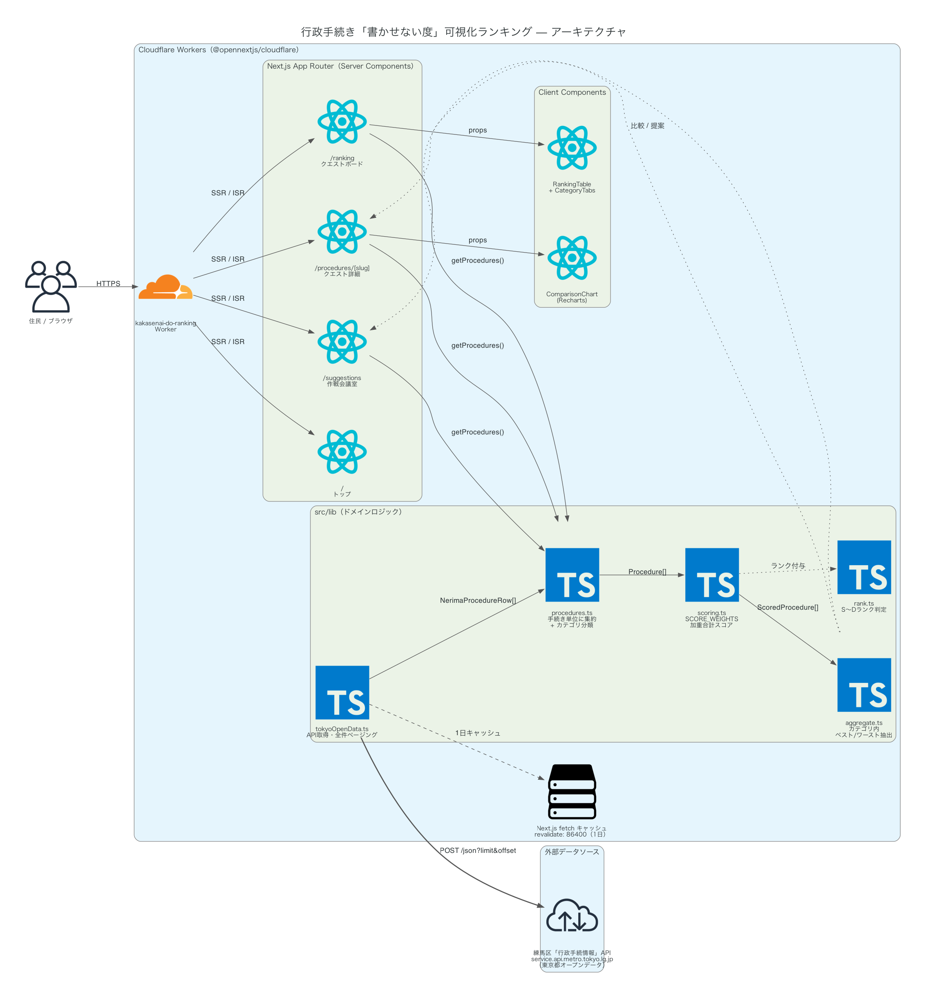

# 行政手続き「書かせない度」可視化ランキング

チームみらいの living-admin 政策「9. 『スパゲティコード化』した制度の簡素化」を、東京都オープンデータのみで実現するプロトタイプです。区が公開している「行政手続情報」データをAPI経由で取得し、手続きに必要な書類数・担当窓口数・オンライン申請可否を定量化して、住民が「どの手続きが面倒か」を一目で把握できるランキングを提供します。

## 政策的位置づけ

- **都知事選公約**: 記載なし
- **チームみらい政策マニフェスト**: living-admin政策「9. 『スパゲティコード化』した制度の簡素化」（[policy.team-mir.ai/policies/living-admin](https://policy.team-mir.ai/policies/living-admin)）

## 主な機能

- **手続き複雑度スコアリング**: 「必要書類数」「担当窓口数」「オンライン申請可否」から手続きごとの複雑度（＝「書かせない度」）を算出
- **カテゴリ別ランキング**: 子育て・住民登録・福祉・くらしその他のカテゴリ別に手続きの複雑度を比較
- **「引き算」提案ビュー**: 複雑度が高い手続きに対し、同カテゴリ内の簡素な運用例を「ベストプラクティス」として自動レコメンド

## 画面構成

1. **トップ（ランディング）ページ（`/`）**: できること・使い方をスクリーンショット付きで紹介
2. **ランキング画面（`/ranking`）**: 手続きカテゴリ別に複雑度ランキングを表示
3. **手続き詳細画面（`/procedures/[slug]`）**: 選択した手続きの必要書類・窓口・オンライン申請リンクと、同カテゴリ平均との比較
4. **改善提案画面（`/suggestions`）**: カテゴリ内で複雑度の低い手続きの運用方法を参考情報として提示

トップページの「使い方」に掲載しているスクリーンショット（[`public/screenshots/`](./public/screenshots/)）は、実際に動作しているアプリをPlaywrightで撮影したものです。UIを変更した際は再撮影してください。

## 使用データ（API）

[東京都オープンデータAPIカタログサイト](https://spec.api.metro.tokyo.lg.jp/spec/search)で「行政手続情報」を検索し、見つかった以下のAPIを実行時に呼び出してデータを取得しています。

| 項目 | 内容 |
| :--- | :--- |
| データセット | [行政手続情報（練馬区）](https://catalog.data.metro.tokyo.lg.jp/dataset/t131202d0000000117) |
| APIエンドポイント | `POST https://service.api.metro.tokyo.lg.jp/api/t131202d0000000117-2dfe94b3ce6c4fe25f40d2ff77653f8b-0/json` |
| 取得項目 | 手続名称・書類正式名称・担当課・担当係・場所・用途・留意事項・電話番号・URL・電子申請 |
| 呼び出し箇所 | [`src/lib/tokyoOpenData.ts`](./src/lib/tokyoOpenData.ts) |

取得した生データ（1手続きにつき1〜複数行、行＝必要書類単位）は [`src/lib/procedures.ts`](./src/lib/procedures.ts) で手続き単位に集約し、必要書類数・窓口数（担当課×担当係の組み合わせ数）・オンライン申請可否（電子申請URLの有無）を算出しています。

> **API調査で分かったこと**: 東京都オープンデータAPIカタログサイトで「行政手続情報」に相当する構造化APIを横断的に探しましたが、この形式（手続き名・必要書類・担当課等を項目として持つデータ）をAPI公開しているのは現時点で**練馬区のみ**でした（世田谷区・杉並区・大田区・千代田区・新宿区・中野区・板橋区は未公開）。そのため、当初設計にあった区市町村間比較は現状実現できず、本プロトタイプは練馬区内の手続き同士の比較にとどめています。他区が同形式のAPIを公開し次第、`src/lib/tokyoOpenData.ts` に取得元を追加することで多区比較に拡張できます。

## 技術スタック

| レイヤー | 選定 |
| :--- | :--- |
| フロントエンド | Next.js (App Router) + TypeScript + Tailwind CSS |
| テーブル表示 | TanStack Table |
| グラフ表示 | Recharts |
| データ取得 | Next.js の `fetch` によるサーバーサイド取得（1日キャッシュ、[`src/lib/tokyoOpenData.ts`](./src/lib/tokyoOpenData.ts)） |
| スコアリング | ルールベースの重みづけ加重合計（[`src/lib/scoring.ts`](./src/lib/scoring.ts)） |

## アーキテクチャ

## 開発

開発環境のセットアップ・コマンド・既知の注意事項は [CONTRIBUTING.md](./CONTRIBUTING.md) を参照してください。
